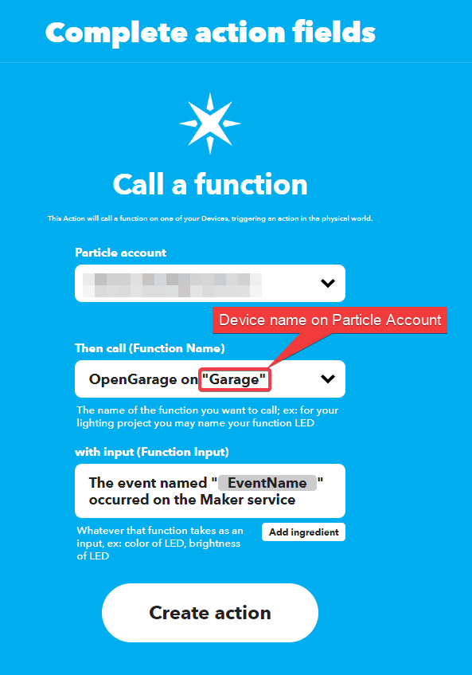

# GarageRemoteSimple

Build a garage Remote using [Particle](https://www.particle.io/) **Photon** with an HR SR04 to detect door status, notify via [IFTTT](https://ifttt.com/explore), Initiate commands from iOs Device

## What it is?

A ParticleIO's Photon microprocessor that connect to HR SR04 (Ultrasonic sensor) to determine if the garage door is opened or closed, it also connect to a 5VDC relay to trigger the garage door's open and close commands.

Additionally I can request this commands via IFTTT, Siri via Shortcuts App, and alert using the Pushover's API (Push Notification)

## Equipment and Tools

- ParticleIO's Photon Microprocessor
- HR SR04
- HR SR04 3D printed Support
- 5 Vdc Relay
- Generic Garage Door Motor
- 5 Vdc Power Supply and Cable

## Steps

 1. Build Circuit
 2. Compile code
    - Locally by Setting up the [Particle Workbench Installation](/WorkbenchSetup.md)
    - Using Particle.io [Web IDE](https://login.particle.io/login?redirect=https://build.particle.io/build)
 3. Integrate to IFTTT
    - [Trigger from IFTTT iOS App](#Trigger-from-IFTTT-iOS-App)
    - [Trigger from Siri](#Trigger-from-Siri)
    - [Create Shortcut on iOS or MacOS](#Create-Shortcut-on-iOS-or-MacOS)
 4. Usage
    - [Opening and Closing the garage](#Opening-and-Closing-the-garage)

## Integrate to IFTTT

### Trigger from IFTTT iOS App

In progress...

### Trigger from Siri

Let's use a IFTTT's webhook to acomplish this, so Login into your [IFTTT](https://ifttt.com/explore) account

Step 1: Create an Applet

Step 2: Choose a Service, enter web and select **Webhooks**

Step 3: Select **Receive a Web request**

Step 4: Enter Event Name, you will use this in the Apple's Shortcut App.

Step 5: Next **"Then That"** Add

Step 6: Search Particle, and select it. You will be asked to sign into your [Particle](https://www.particle.io/) account

Step 7: Choose an action, **Call a function**

Step 8: Select your Particle account, Function name, OpenGarage is name of the function created for the Device call "Garage". To finish click **Create action**

### Create Shortcut on iOS or MacOS

In progress...

### Opening and Closing the garage

In progress...